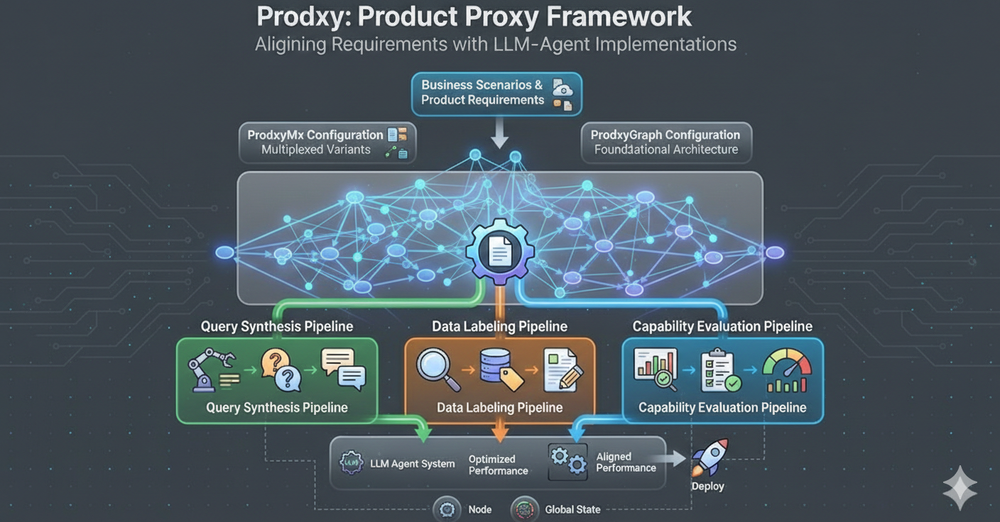
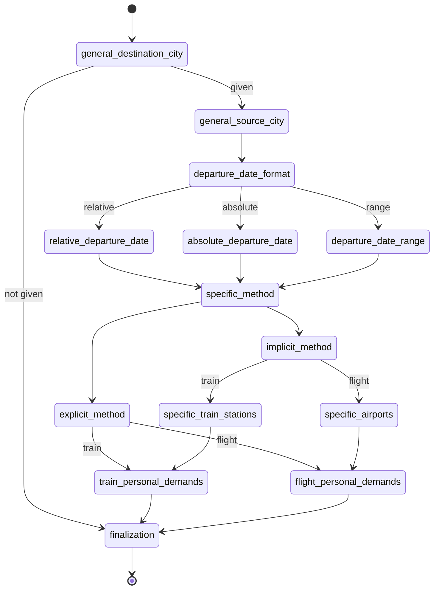
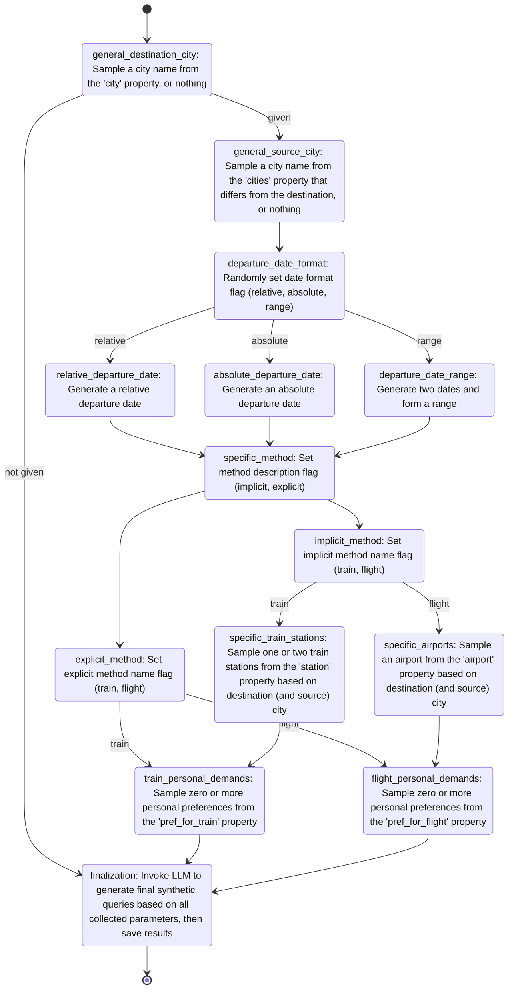
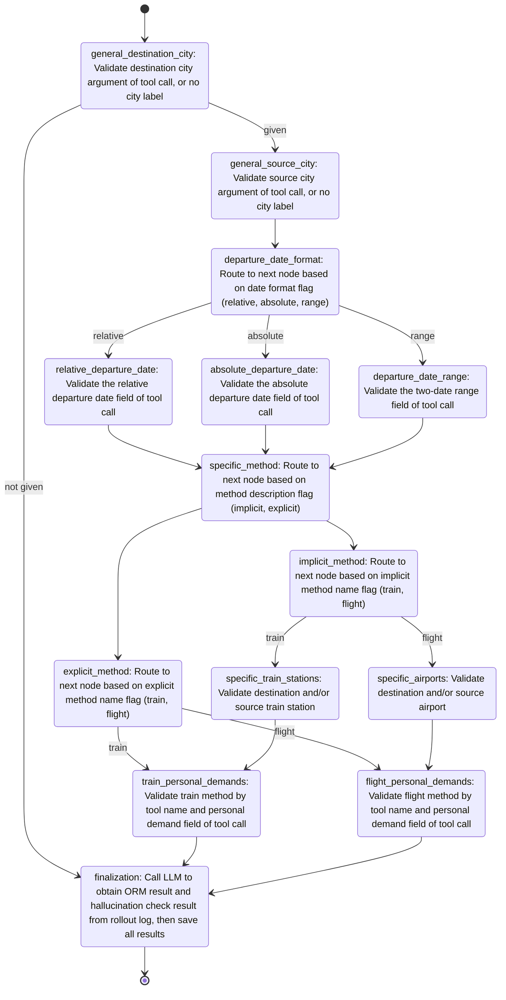

# Introduction

Prodxy (Product Proxy) is a low-code framework that ensures close alignment between product requirements and engineering implementation by converting business scenarios into executable pipelines for LLM-agent-related query synthesis, data labeling and capability evaluation, sharing the same underlying graph structure.

Prodxy（Product Proxy）是一个低代码框架，通过将业务场景转换为可执行的管道，确保产品需求与工程实现之间的紧密对齐，用于LLM Agent相关的查询合成、数据标注和能力评估，共享相同的底层图结构。



1. **Understand your business scenario or product requirements**: Identify the key components, constraints, and expected behaviors of your LLM agent system.

2. **Build a `ProdxyGraph` as the shared foundational architecture**: Create a graph structure that represents the core decision flow and processing steps of your system.

3. **Create specialized pipelines to `ProdxyGraph`**:
   - If you don't have queries yet, or you need more queries, add a **query synthesis pipeline** on top of the Prodxy graph to generate synthetic queries
   - If you already have queries that need to be labeled, add a **data labeling pipeline** on top of the Prodxy graph to annotate and process your existing data
   - If you need to evaluate capabilities, build an **evaluation pipeline** on top of the Prodxy graph to assess performance and quality metrics

All these pipelines (or any number of additional pipelines) can be described using a single **ProdxyMx** configuration, enabling multiplexed variants that share the same base graph structure while having different operations for different purposes. 

1. **了解您的业务场景或产品需求**：识别您的LLM代理系统的关键组件、约束条件和预期行为。

2. **构建`ProdxyGraph`作为共享的基础架构**：创建一个图结构，代表系统的核心决策流程和处理步骤。

3. **在`ProdxyGraph`上创建专用管道**：
   - 如果您还没有查询，或者需要更多查询，请在Prodxy图之上添加**查询合成管道**来生成合成查询
   - 如果您已有需要标注的查询，请在Prodxy图之上添加**数据标注管道**来注释和处理现有数据
   - 如果您需要评估能力，请在Prodxy图之上构建**评估管道**来评估性能和质量指标

所有这些管道（或任意数量的附加管道）都可以使用单一的**ProdxyMx**配置进行描述，从而启用多路复用变体，这些变体共享相同的基础图结构，但针对不同目的具有不同的操作。


[中文版](README_zh.md)

# Quick Start

## Clone

```
git clone https://github.com/0-1CxH/Prodxy.git
```


## Preapre Environment 

```python>=3.10``` is required.

These packages are required:

```
langgraph
asyncio
jsonpath_ng
```

These packages are optional:

```
grandalf
```

If everything is right, you can pass the regression tests:

```
python -m unittest discover tests
```

## Write `MX Config`

MX (Multiplex) Config is the core configuration format in Prodxy that allows you to define multiple variants of the same graph using a single configuration file. This enables you to share the same graph structure while having different operations for different purposes (e.g., variant A vs variant B).

### Basic Structure

An MX config file contains the following top-level sections:

- **`mx_node_configs`**: Array of node configurations with multiplexed operations and conditions
- **`properties`** (optional): Property library definitions for sampling operations
- **`constrains`** (optional): Constraints between properties
- **`start_node_placeholder`** (optional): Custom start node placeholder (default: `_start`)
- **`end_node_placeholder`** (optional): Custom end node placeholder (default: `_end`)

### Node Configuration

Each node in `mx_node_configs` must have a `name` field and can contain:

- **Base operations/conditions**: `operations` and `conditions` (used as `_default` variant)
- **Variant-specific operations/conditions**: Use suffix notation like `operations(variant_a)`, `conditions(variant_b)`, etc.

#### Example Node Structure:
```yaml
- name: "node_name"
  # Base operations (becomes _default variant)
  operations:
    - main_op_name: "operation_name"
      condition_op_name: "condition_name"
      read_paths:
        param1: "$.json_path"
        param2: "@literal_value"
      write_path: "$.output_path"
  conditions:
    condition_value: "next_node_name"

  # Variant-specific operations
  operations(variant_a):
    - main_op_name: "variant_a_operation"
      # ... other fields
  conditions(variant_a):
    true: "next_variant_a_node"

  operations(variant_b):
    - main_op_name: "variant_b_operation"
      # ... other fields
  conditions(variant_b):
    true: "next_variant_b_node"
```

### Multiplexing Variants

When you define operations with suffixes like `(variant_a)`, `(variant_b)`, etc., Prodxy automatically creates separate graph variants:

- Each unique suffix becomes a variant name (e.g., `variant_a`, `variant_b`)
- If base `operations`/`conditions` exist without suffixes, they form the `_default` variant
- Each variant contains only the nodes that have content for that specific suffix

### Path Resolution in Operations

The `read_paths` field supports three types of path resolution:

1. **JSON Path (`$` prefix)**: Resolves against the global state
   ```yaml
   read_paths:
     data: "$.user_input"
   ```

2. **Evaluable Values (`@` prefix)**: First attempts to evaluate as a Python expression, falls back to literal string if evaluation fails
   ```yaml
   read_paths:
     number: "@42"           # evaluates to integer 42
     tuple: "@(1, 2, 3)"     # evaluates to tuple (1, 2, 3)
     string: "@hello world"  # remains as string "hello world" (eval fails)
   ```

3. **Plain Literals**: Used as-is without any processing (no special prefix)
   ```yaml
   read_paths:
     constant: "fixed_value"
   ```
## Execute

Prodxy provides a command-line interface for batch execution of MX graphs with flexible input/output options and parallel processing capabilities.

### Basic Usage

```bash
python -m prodxy.execution \
  --mx-config <path_to_mx_yaml> \
  --variant <variant_name> \
  --input <input_spec> \
  [--output <output_spec>] \
  [--parallelism <num_processes>] \
  [--dump-trace]
```

### Input Modes

The `--input` parameter supports three different modes:

1. **Null Mode**: Specify an integer to execute the graph N times without input data
   ```bash
   --input 100  # Execute 100 times with empty input {}
   ```

2. **File Mode**: Provide a directory path containing JSON files
   ```bash
   --input ./input_data/  # Process all .json files in the directory
   ```
   Each JSON file will be loaded as input data, and the filename (without .json extension) will be used as the identifier.

3. **Line Mode**: Provide a path to a JSONL file (one JSON object per line)
   ```bash
   --input ./input_data.jsonl  # Process each line as separate input
   ```
   Each line number will be used as the identifier for the corresponding input.

### Output Modes

The `--output` parameter determines how results are saved:

1. **Null Mode**: No output (omit the `--output` parameter)
   ```bash
   # Results are processed but not saved
   ```

2. **Line Mode**: Output to a JSONL file (appends results as JSON lines)
   ```bash
   --output ./results.jsonl  # Append results as JSON lines
   ```

3. **File Mode**: Output to a directory (creates individual JSON files)
   ```bash
   --output ./results/  # Creates files like ./results/{identifier}.json
   ```

### Additional Options

- **`--parallelism` (`-p`)**: Control maximum concurrent executions
  - Default: CPU core count
  - Set to 1 for sequential execution
  - Example: `--parallelism 8`

- **`--dump-trace` (`-d`)**: Include execution trace information in output
  - When enabled, output includes both `global_state` and `trace` fields
  - Useful for debugging and analysis


# Core Concepts


## Prodxy Node

`ProdxyNode` represents a single processing unit in the graph that executes a sequence of operations. Each node contains one or more `ProdxyOperationConfig` instances that define the main operation to execute, a condition operation for routing, input paths to read from the global state, and an output path to write results. Nodes process the global state by executing their operations in sequence, updating the state with results, and setting condition signals that determine the next node in the graph execution flow.

## Prodxy Graph

`ProdxyGraph` is the core execution graph that orchestrates the flow of operations between nodes. It's built using LangGraph's `StateGraph` and manages the global state throughout execution. Each graph contains a collection of `ProdxyNode` instances connected by conditional edges based on the node configurations. The graph supports asynchronous execution, maintains a trace of all operations performed, and can be initialized from dictionary or YAML configurations.

## Global State

The `ProdxyGlobalState` is a JSONPath-enabled dictionary (powered by `JsonPathDict`, see later chapter for details) that stores and manages data throughout the Prodxy graph execution. It provides efficient access to nested data structures using JSONPath expressions.

## Prodxy Multiplex

`ProdxyMxBuilder` is a multi-variant graph builder that supports multiplex of the same base configuration. It allows defining multiple variants of the same graph with different operations and conditions using suffix notation like `operations(a)`, `conditions(b)`, etc. The builder automatically transforms these MX configurations into standard graph configurations and creates separate `ProdxyGraph` instances for each variant. It also integrates with a property library for sampling operations.

## Prodxy Property Library

The `ProdxyPropertyLibrary` provides a structured way to define and sample from hierarchical properties with weights and constraints. It enables realistic data generation for testing by organizing values into properties, categories, and items, with support for weighted sampling and constraint-based relationships.


# Examples


## Toy Example for Understanding Concepts

Let's examine a simple but comprehensive example that demonstrates the core concepts of Prodxy using the `example/mx_config_toy.yaml` configuration file.

### Configuration Overview

This example defines a graph with three nodes (`node1`, `node2`, `node3`) and two variants (`a` and `b`). It showcases multiplexing, property libraries, and various built-in operations working together.

```yaml
mx_node_configs:
  - name: "node1"
    operations(a):
      - main_op_name: "valgen:range"
        condition_op_name: "condition:true"
        read_paths:
          boundary: "@(1,10)"
          is_integer: "@True"
          count: "@5"
        write_path: "$.target"
    conditions(a):
      true: "node2"
    operations(b):
      - main_op_name: "valgen:range"
        condition_op_name: "condition:true"
        read_paths:
          boundary: "@(3,6)"
          is_integer: "@True"
          count: "@1"
        write_path: "$.source"
    conditions(b):
      true: "node2"
  - name: "node2"
    operations(a):
      - main_op_name: "property:sample"
        condition_op_name: "condition:true"
        read_paths:
          property_name: "date_alias"
        write_path: "$.category"
    conditions(a):
      true: "node3"
    operations(b):
      - main_op_name: "judge:include"
        condition_op_name: "condition:identity"
        read_paths:
          source: "$.source"
          target: "$.target"
        write_path: "$.comparison"
  - name: "node3"
    operations(a):
      - main_op_name: "relative:date"
        condition_op_name: "condition:true"
        read_paths:
          reference_date: "2026-01-01"
          shift: "$.category"
        write_path: "$.result"
properties:
  - property_name: date_alias
    categories:
      - category_name: "+1D"
        weight: 1.0
        items:
          - item_name: "tomorrow"
            weight: 1.0
          - item_name: "next day"
            weight: 2.0
      - category_name: "-1D"
        weight: 2.0
        items:
          - item_name: "yesterday"
            weight: 2.0
          - item_name: "previous day"
            weight: 1.0
```

### Key Concepts Demonstrated

*1. Multiplexing Variants*

The configuration defines two variants: `(a)` and `(b)`. Each variant has its own set of operations and conditions:

- **Variant (a)**: Generates a range of 5 random integers between 1-10 (`$.target`), samples a date alias from the property library (`$.category`), then calculates a relative date based on the sampled alias (`$.result`).
- **Variant (b)**: Generates a single random integer between 3-6 (`$.source`), then checks if this value is included in the target range from variant (a) (`$.comparison`).

This demonstrates how a single configuration can produce multiple graph variants with different behaviors while sharing the same node structure.

*2. Path Resolution Mechanisms*

The example uses different path resolution mechanisms:

- **Evaluable Values (`@` prefix)**:
  - `boundary: "@(1,10)"` evaluates to a Python tuple `(1, 10)`
  - `is_integer: "@True"` evaluates to the boolean `True`
  - `count: "@5"` evaluates to the integer `5`

- **JSON Path (`$` prefix)**:
  - `write_path: "$.target"` writes to the global state under the key `target`
  - `read_paths: {source: "$.source", target: "$.target"}` reads from the global state

*3. Property Library with Weighted Sampling*

The `properties` section defines a property library for date aliases with weighted categories and items:

- The `"+1D"` category has weight 1.0 and contains "tomorrow" (weight 1.0) and "next day" (weight 2.0)
- The `"-1D"` category has weight 2.0 and contains "yesterday" (weight 2.0) and "previous day" (weight 1.0)

When sampling, categories and items are selected proportionally to their weights. For example, "-1D" is twice as likely to be selected as "+1D", and within "-1D", "yesterday" is twice as likely as "previous day".

*4. Built-in Operations*

The example uses several built-in operation modules:

- **`valgen:range`**: Generates random values within specified boundaries
- **`property:sample`**: Samples from the property library based on weights
- **`judge:include`**: Checks if one value is included in another (useful for validation)
- **`relative:date`**: Calculates dates relative to a reference date using natural language expressions

*5. Execution Flow*

- **Variant (a) flow**: `node1` → `node2` → `node3`
  - Generates target range → Samples date category → Calculates relative date

- **Variant (b) flow**: `node1` → `node2`
  - Generates source value → Checks inclusion in target range

This toy example demonstrates how Prodxy's core concepts work together to create flexible, reusable graph configurations that can serve multiple purposes (e.g., data generation vs. validation) through multiplexing.


## Real-World Product Scenario

This example `examples/search_flights_and_trains.yaml` demonstrates a practical LLM agent implementation for the "search flights and trains" business scenario. The requirements are as follows: 

```text
- Users must specify a destination city in their query; the source city is optional (location context is used if omitted)
- Users can specify departure dates as absolute dates, relative expressions (e.g., "tomorrow"), or date ranges; if unspecified, today's date is used
- Transportation method (flight or train) can be specified either explicitly or implicitly through airport/train station names in the query
- Users may include additional preferences such as first-class seating, meal service, or WiFi availability
- The agent must invoke the appropriate tools with correct parameters that satisfy all user requirements
- Agent responses must be factually accurate and free from hallucinations or harmful content
```

### Deisgn of Prodxy Graph Architecture

The Prodxy graph architecture is designed as follows:



### Building the Query Synthesis Pipeline

Building the query synthesis pipeline involves populating the Prodxy graph with appropriate operations:



### Building the Capability Evaluation Pipeline

Similarly, the capability evaluation pipeline uses the same Prodxy graph structure but with a different set of validation operations:



# Built-In Operations

Prodxy provides several built-in operation modules that can be used within Prodxy graphs to perform common tasks. These operations are designed to work with the global state and can be easily integrated into your graph configurations.

## Attribute Sampler

The `attribute_sampler.py` module provides functionality for sampling values from a property library with weighted probabilities and constraints. This is particularly useful for generating realistic test data.

### Key Components:

- **ValueGeneratorPrimitives**: Static methods for generating random values:
  - `enum()`: Sample from a list, tuple, set, or dictionary (with weights)
  - `range()`: Generate random integers or floats within a boundary
  - `date()`: Generate random dates within a boundary range
  - `time()`: Generate random times within a boundary range

- **Property Library Classes**:
  - `ProdxyPropertyItem`: Represents an individual item with a name and weight
  - `ProdxyPropertyCategory`: Groups items into categories with weights
  - `ProdxyProperty`: Contains categories of related properties
  - `PropertyIndicator`: Specifies which property, category, or item to reference
  - `ProdxyConstrain`: Defines constraints between properties
  - `ProdxyPropertyLibraryConfig`: Configuration container for properties and constraints
  - `ProdxyPropertyLibrary`: Main class for loading and sampling from property libraries

The property library supports loading from dictionaries or YAML files and provides methods like `sample_categories()` and `sample_items()` to generate values based on the defined structure and weights.

## Field Analyzer

The `field_analyzer.py` module provides the `FieldCentricAnalyzer` class for querying and filtering lists of dictionaries in a field-centric way.

### Features:

- Extract values for a specific field across all dictionaries: `analyzer.field_name`
- Filter dictionaries by field value: `analyzer.field_name(value)`
- Support for comparison operators: `analyzer.field_name(value, "gt")` (greater than), `"lt"` (less than), etc.
- Special wildcard operator: `analyzer.field_name("*")` returns dictionaries containing the field
- Grouping functionality: iterate over `(value, group)` pairs where each group contains dictionaries with that field value
- Load data directly from JSONL files using the `load()` class method

This analyzer enables powerful data exploration and filtering capabilities within Prodxy operations.

## Judge Functions

The `judge_func.py` module provides comparison utilities through the `JudgePrimitives` class.

### Methods:

- **`equal(target, source, depth=0)`**: Performs deep equality comparison with special handling for different container types:
  - Non-container types: Direct comparison with string conversion fallback
  - Lists: Ordered comparison at top level, unordered at nested levels
  - Tuples: Always ordered comparison
  - Sets: Unordered comparison
  - Dictionaries: Key-value pair comparison

- **`include(target, source, recursive=False)`**: Checks if source is included in target with flexible matching:
  - String targets: Check if source string is contained within target
  - Non-key-value containers (lists, sets, tuples): Check inclusion of elements
  - Key-value containers (dicts): Check if keys/values contain source or if all key-value pairs from source exist in target
  - Recursive mode enables nested inclusion checks

These functions are useful for validation and conditional logic within Prodxy graphs.

## LLM Request

The `llm_request.py` module provides utilities for making LLM API requests and processing responses.

### Components:

- **`LLMResponse`**: Dataclass containing the result of an LLM request with fields for success status, error messages, prompts, and responses
- **`RawLLMRequest`**: Low-level request handler with methods like `by_curl()` for making direct API calls
- **`LLMResponsePostProcess`**: Response processing utilities:
  - `strip_thinking()`: Extract content after thinking delimiters
  - `extract_bool()`: Parse boolean responses from various formats
  - `extract_json()`: Extract and parse JSON from responses, handling code blocks and malformed JSON
- **`LLMRequest`**: High-level interface with:
  - Predefined prompts for boolean and JSON responses
  - Automatic retry logic
  - Integrated response processing based on target type ("string", "bool", "json")

This module simplifies integration with LLM APIs while handling common response parsing scenarios.

## Relative Time

The `relative_time.py` module provides the `RelativeTimePrimitives` class for calculating dates and times relative to a reference point.

### Methods:

- **`calculate_date(reference_date, shift)`**: Calculate dates relative to a reference date with formats like:
  - `[+/-x]D`: Days before/after reference
  - `[+/-x]m[+/-y]`: Day of month x months before/after reference
  - `[+/-x]w[y]`: Day of week in week x weeks before/after reference
  - `[Last/Next]w[y]`: Nearest previous/next day of week

- **`calculate_time(reference_time, shift)`**: Calculate times relative to a reference time with formats like:
  - `[+/-][x]H[y]M[z]S`: Hours/minutes/seconds offset
  - `C12[Last/Next][time]`: Nearest time in 12-hour format
  - `[C24][Last/Next][time]`: Nearest time in 24-hour format

- **`calculate_datetime(reference_datetime, shift)`**: Combine date and time calculations
- **`compare_datetime(target, source)`**: Calculate absolute difference between datetime values in seconds

These utilities are essential for time-based operations in Prodxy graphs, such as scheduling, expiration, or temporal reasoning.
