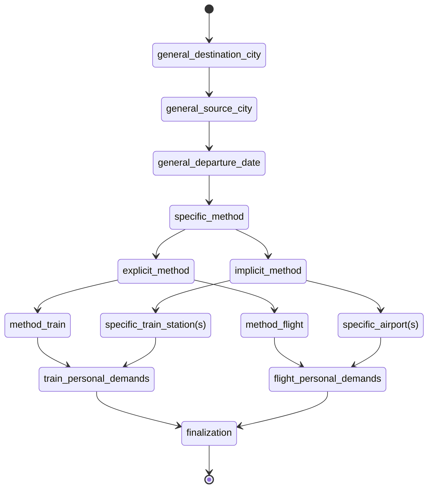

## Env 

```python>=3.10``` is required.

There are some packages required:

```
langgraph
jsonpath_ng
```

These packages are optional:

```
grandalf
```


## Example

### `examples/search_flights_and_trains.yaml`

The example demostrates an LLM agent product's business scene 'search flights and trains', which is described as follows: 

```
- User must give a specific destination city in text query, but giving a source city in text query is optional, location context is used if not.
- User can choose to point out the departure date, relative date or date range in text query, if not, use today.
- User might or might not specify the method (flight or train) by directly clarification or by specify the airport name, train station name of source / destination city in text query, if is the latter case, the city is implied.
- User can have extra demands, such as first-class cabin, meal included, or WiFi connection for the flight or train trip.
```

The Prodxy graph is designed as:




the query synthesis  pipeline of 


```


```


and the rollout evaluation pipeline 