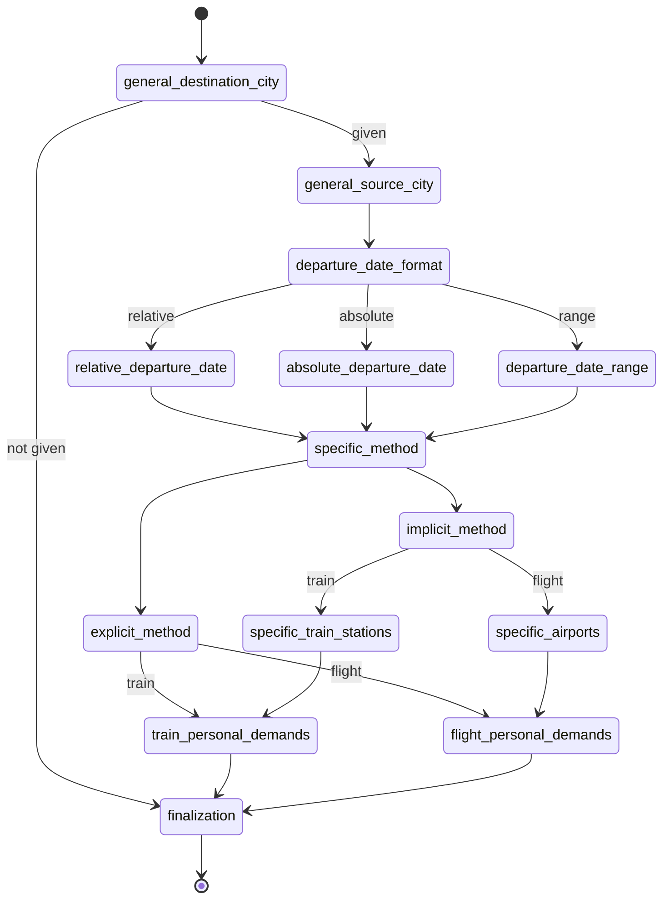
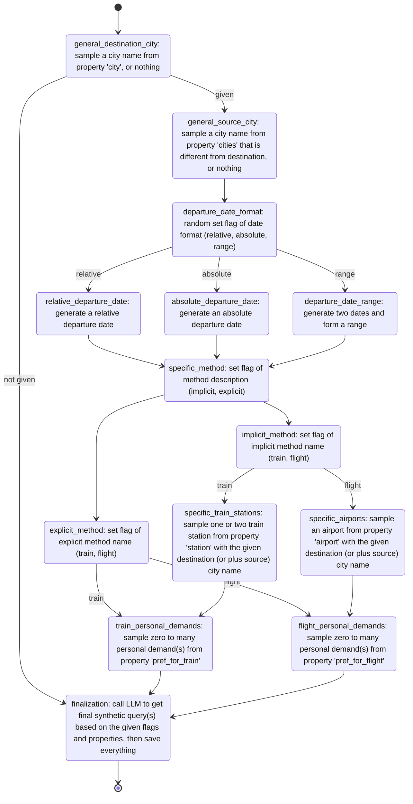
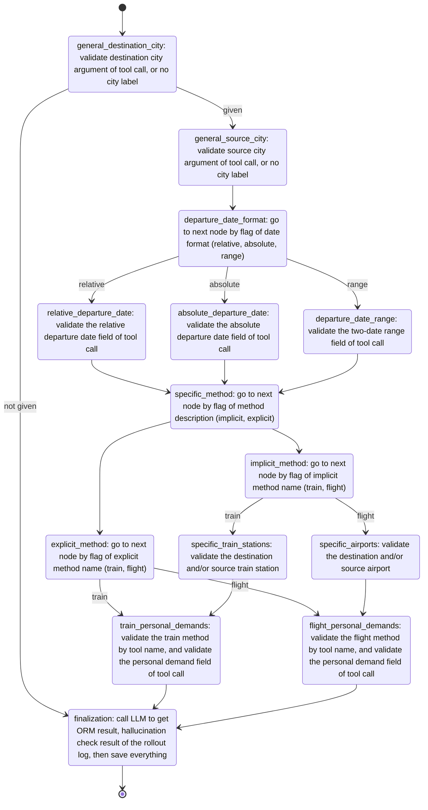

# Introduction


# Quick Start

## Environment 

```python>=3.10``` is required.

There are some packages required:

```
langgraph
asyncio
jsonpath_ng
```

These packages are optional:

```
grandalf
```

If everything is right, you can pass the regression tests:

```
python -m unittest discover tests
```


## UI


## The `MX Config`


## Batch Mode


# Example

## `examples/search_flights_and_trains.yaml`

The example demostrates an LLM agent product's business scene 'search flights and trains', which is described as follows: 

```text
- User must give a specific destination city in text query, but giving a source city in text query is optional, location context is used if not.
- User can choose to point out the departure date, relative date or date range in text query, if not, use today.
- User might or might not specify the method (flight or train) by directly clarification or by specify the airport name, train station name of source / destination city in text query, if is the latter case, the city is implied.
- User can have extra demands, such as first-class cabin, meal included, or WiFi connection for the flight or train trip.
- The agent needs to call correct tool with correct arguments that meets all requirements of user.
- The agent's response given to user should not contain halllucination or harmful information.
```

The Prodxy graph is designed as:




Then, building the query synthesis pipeline is easy as filling the Prodxy graph with operations:



And, the agent evaluation pipeline will still use the Prodxy graph, but filling with another set of operations:



