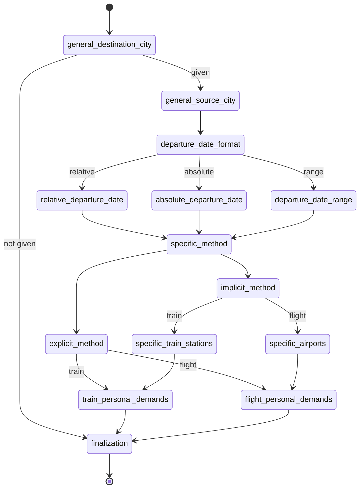
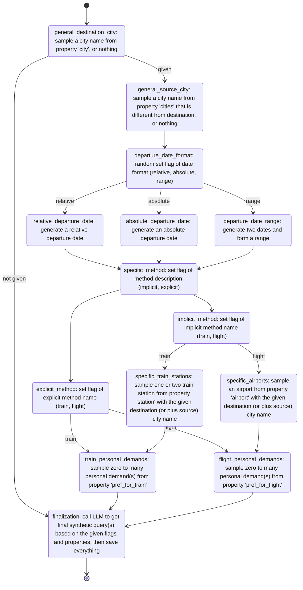
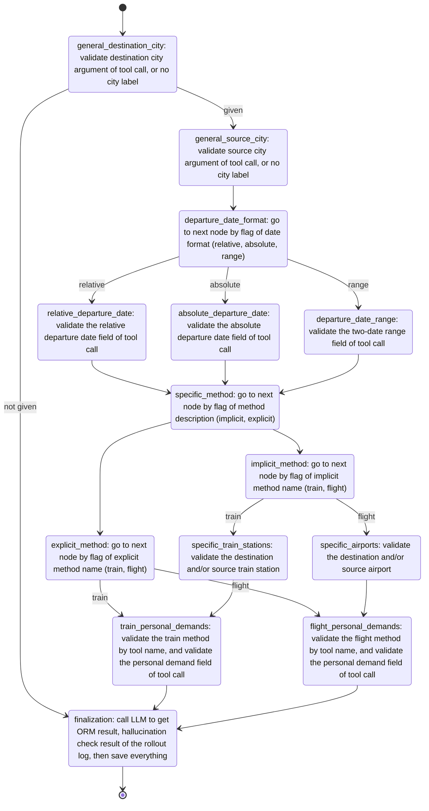

# Introduction
Prodxy (Product Proxy) is a low-code framework that ensures close alignment between product requirements and engineering implementation by converting business scenarios into executable pipelines for LLM-agent-related data synthesis and capability evaluation. 

# Quick Start

## Environment 

```python>=3.10``` is required.

There are some packages required:

```
langgraph
asyncio
jsonpath_ng
```

These packages are optional:

```
grandalf
```

If everything is right, you can pass the regression tests:

```
python -m unittest discover tests
```


## UI


## The `MX Config`


## Batch Mode


# Core Concepts


## Prodxy Node

`ProdxyNode` represents a single processing unit in the graph that executes a sequence of operations. Each node contains one or more `ProdxyOperationConfig` instances that define the main operation to execute, a condition operation for routing, input paths to read from the global state, and an output path to write results. Nodes process the global state by executing their operations in sequence, updating the state with results, and setting condition signals that determine the next node in the graph execution flow.

## Prodxy Graph

`ProdxyGraph` is the core execution graph that orchestrates the flow of operations between nodes. It's built using LangGraph's `StateGraph` and manages the global state throughout execution. Each graph contains a collection of `ProdxyNode` instances connected by conditional edges based on the node configurations. The graph supports asynchronous execution, maintains a trace of all operations performed, and can be initialized from dictionary or YAML configurations.

## Global State

The `ProdxyGlobalState` is a JSONPath-enabled dictionary (powered by `JsonPathDict`, see later chapter for details) that stores and manages data throughout the Prodxy graph execution. It provides efficient access to nested data structures using JSONPath expressions.

## Prodxy Multiplex

`ProdxyMxBuilder` is a multi-variant graph builder that supports multiplex of the same base configuration. It allows defining multiple variants of the same graph with different operations and conditions using suffix notation like `operations(a)`, `conditions(b)`, etc. The builder automatically transforms these MX configurations into standard graph configurations and creates separate `ProdxyGraph` instances for each variant. It also integrates with a property library for sampling operations.

## Prodxy Property Library

The `ProdxyPropertyLibrary` provides a structured way to define and sample from hierarchical properties with weights and constraints. It enables realistic data generation for testing by organizing values into properties, categories, and items, with support for weighted sampling and constraint-based relationships.


# Example

## `examples/search_flights_and_trains.yaml`

The example demostrates an LLM agent product's business scene 'search flights and trains', which is described as follows: 

```text
- User must give a specific destination city in text query, but giving a source city in text query is optional, location context is used if not.
- User can choose to point out the departure date, relative date or date range in text query, if not, use today.
- User might or might not specify the method (flight or train) by directly clarification or by specify the airport name, train station name of source / destination city in text query, if is the latter case, the city is implied.
- User can have extra demands, such as first-class cabin, meal included, or WiFi connection for the flight or train trip.
- The agent needs to call correct tool with correct arguments that meets all requirements of user.
- The agent's response given to user should not contain halllucination or harmful information.
```

The Prodxy graph is designed as:




Then, building the query synthesis pipeline is easy as filling the Prodxy graph with operations:



And, the agent evaluation pipeline will still use the Prodxy graph, but filling with another set of operations:



# Built-In Operations

Prodxy provides several built-in operation modules that can be used within Prodxy graphs to perform common tasks. These operations are designed to work with the global state and can be easily integrated into your graph configurations.

## Attribute Sampler

The `attribute_sampler.py` module provides functionality for sampling values from a property library with weighted probabilities and constraints. This is particularly useful for generating realistic test data.

### Key Components:

- **ValueGeneratorPrimitives**: Static methods for generating random values:
  - `enum()`: Sample from a list, tuple, set, or dictionary (with weights)
  - `range()`: Generate random integers or floats within a boundary
  - `date()`: Generate random dates within a boundary range
  - `time()`: Generate random times within a boundary range

- **Property Library Classes**:
  - `ProdxyPropertyItem`: Represents an individual item with a name and weight
  - `ProdxyPropertyCategory`: Groups items into categories with weights
  - `ProdxyProperty`: Contains categories of related properties
  - `PropertyIndicator`: Specifies which property, category, or item to reference
  - `ProdxyConstrain`: Defines constraints between properties
  - `ProdxyPropertyLibraryConfig`: Configuration container for properties and constraints
  - `ProdxyPropertyLibrary`: Main class for loading and sampling from property libraries

The property library supports loading from dictionaries or YAML files and provides methods like `sample_categories()` and `sample_items()` to generate values based on the defined structure and weights.

## Field Analyzer

The `field_analyzer.py` module provides the `FieldCentricAnalyzer` class for querying and filtering lists of dictionaries in a field-centric way.

### Features:

- Extract values for a specific field across all dictionaries: `analyzer.field_name`
- Filter dictionaries by field value: `analyzer.field_name(value)`
- Support for comparison operators: `analyzer.field_name(value, "gt")` (greater than), `"lt"` (less than), etc.
- Special wildcard operator: `analyzer.field_name("*")` returns dictionaries containing the field
- Grouping functionality: iterate over `(value, group)` pairs where each group contains dictionaries with that field value
- Load data directly from JSONL files using the `load()` class method

This analyzer enables powerful data exploration and filtering capabilities within Prodxy operations.

## Judge Functions

The `judge_func.py` module provides comparison utilities through the `JudgePrimitives` class.

### Methods:

- **`equal(target, source, depth=0)`**: Performs deep equality comparison with special handling for different container types:
  - Non-container types: Direct comparison with string conversion fallback
  - Lists: Ordered comparison at top level, unordered at nested levels
  - Tuples: Always ordered comparison
  - Sets: Unordered comparison
  - Dictionaries: Key-value pair comparison

- **`include(target, source, recursive=False)`**: Checks if source is included in target with flexible matching:
  - String targets: Check if source string is contained within target
  - Non-key-value containers (lists, sets, tuples): Check inclusion of elements
  - Key-value containers (dicts): Check if keys/values contain source or if all key-value pairs from source exist in target
  - Recursive mode enables nested inclusion checks

These functions are useful for validation and conditional logic within Prodxy graphs.

## LLM Request

The `llm_request.py` module provides utilities for making LLM API requests and processing responses.

### Components:

- **`LLMResponse`**: Dataclass containing the result of an LLM request with fields for success status, error messages, prompts, and responses
- **`RawLLMRequest`**: Low-level request handler with methods like `by_curl()` for making direct API calls
- **`LLMResponsePostProcess`**: Response processing utilities:
  - `strip_thinking()`: Extract content after thinking delimiters
  - `extract_bool()`: Parse boolean responses from various formats
  - `extract_json()`: Extract and parse JSON from responses, handling code blocks and malformed JSON
- **`LLMRequest`**: High-level interface with:
  - Predefined prompts for boolean and JSON responses
  - Automatic retry logic
  - Integrated response processing based on target type ("string", "bool", "json")

This module simplifies integration with LLM APIs while handling common response parsing scenarios.

## Relative Time

The `relative_time.py` module provides the `RelativeTimePrimitives` class for calculating dates and times relative to a reference point.

### Methods:

- **`calculate_date(reference_date, shift)`**: Calculate dates relative to a reference date with formats like:
  - `[+/-x]D`: Days before/after reference
  - `[+/-x]m[+/-y]`: Day of month x months before/after reference
  - `[+/-x]w[y]`: Day of week in week x weeks before/after reference
  - `[Last/Next]w[y]`: Nearest previous/next day of week

- **`calculate_time(reference_time, shift)`**: Calculate times relative to a reference time with formats like:
  - `[+/-][x]H[y]M[z]S`: Hours/minutes/seconds offset
  - `C12[Last/Next][time]`: Nearest time in 12-hour format
  - `[C24][Last/Next][time]`: Nearest time in 24-hour format

- **`calculate_datetime(reference_datetime, shift)`**: Combine date and time calculations
- **`compare_datetime(target, source)`**: Calculate absolute difference between datetime values in seconds

These utilities are essential for time-based operations in Prodxy graphs, such as scheduling, expiration, or temporal reasoning.