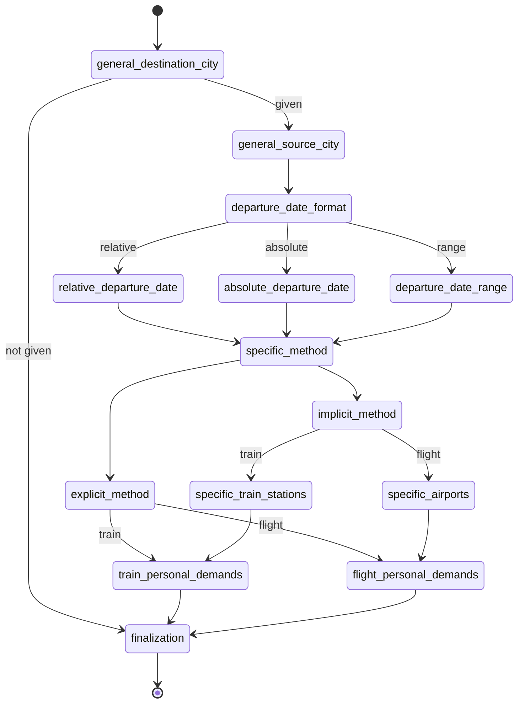
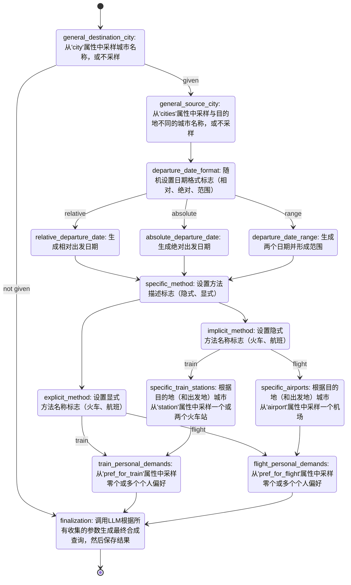
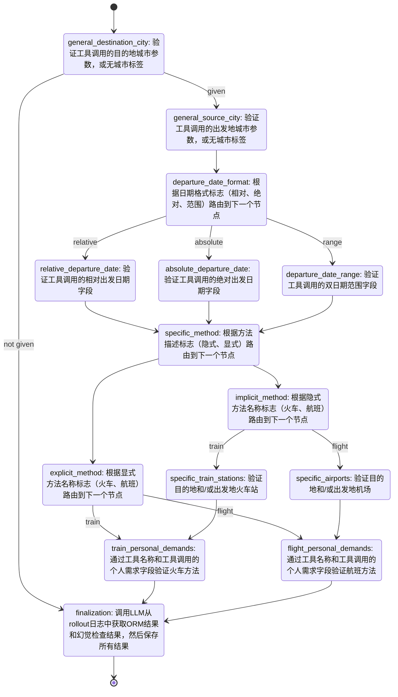

# 介绍

Prodxy (Product Proxy) is a low-code framework that ensures close alignment between product requirements and engineering implementation by converting business scenarios into executable pipelines for LLM-agent-related query synthesis, data labeling and capability evaluation, sharing the same underlying graph structure.

Prodxy（Product Proxy）是一个低代码框架，通过将业务场景转换为可执行的管道，确保产品需求与工程实现之间的紧密对齐，用于LLM代理相关的查询合成、数据标注和能力评估，共享相同的底层图结构。


1. **Understand your business scenario or product requirements**: Identify the key components, constraints, and expected behaviors of your LLM agent system.

2. **Build a `ProdxyGraph` as the shared foundational architecture**: Create a graph structure that represents the core decision flow and processing steps of your system.

3. **Create specialized pipelines to `ProdxyGraph`**:
   - If you don't have queries yet, or you need more queries, add a **query synthesis pipeline** on top of the Prodxy graph to generate synthetic queries
   - If you already have queries that need to be labeled, add a **data labeling pipeline** on top of the Prodxy graph to annotate and process your existing data
   - If you need to evaluate capabilities, build an **evaluation pipeline** on top of the Prodxy graph to assess performance and quality metrics

All these pipelines (or any number of additional pipelines) can be described using a single **ProdxyMx** configuration, enabling multiplexed variants that share the same base graph structure while having different operations for different purposes. 

1. **了解您的业务场景或产品需求**：识别您的LLM代理系统的关键组件、约束条件和预期行为。

2. **构建`ProdxyGraph`作为共享的基础架构**：创建一个图结构，代表系统的核心决策流程和处理步骤。

3. **在`ProdxyGraph`上创建专用管道**：
   - 如果您还没有查询，或者需要更多查询，请在Prodxy图之上添加**查询合成管道**来生成合成查询
   - 如果您已有需要标注的查询，请在Prodxy图之上添加**数据标注管道**来注释和处理现有数据
   - 如果您需要评估能力，请在Prodxy图之上构建**评估管道**来评估性能和质量指标

所有这些管道（或任意数量的附加管道）都可以使用单一的**ProdxyMx**配置进行描述，从而启用多路复用变体，这些变体共享相同的基础图结构，但针对不同目的具有不同的操作。


[English Version](README.md)


# 快速开始

## 克隆

```
git clone https://github.com/0-1CxH/Prodxy.git
```

## 准备环境

需要```python>=3.10```。

需要以下包：

```
langgraph
asyncio
jsonpath_ng
```

可选包：

```
grandalf
```

如果一切正常，您可以通过回归测试：

```
python -m unittest discover tests
```

## 编写`MX配置`

MX（Multiplex）配置是Prodxy中的核心配置格式，允许您使用单个配置文件定义同一图的多个变体。这使您能够共享相同的图结构，同时针对不同目的（例如变体A与变体B）具有不同的操作。

### 基本结构

MX配置文件包含以下顶层部分：

- **`mx_node_configs`**：带有复用操作和条件的节点配置数组
- **`properties`**（可选）：用于采样操作的属性库定义
- **`constrains`**（可选）：属性之间的约束
- **`start_node_placeholder`**（可选）：自定义起始节点占位符（默认：`_start`）
- **`end_node_placeholder`**（可选）：自定义结束节点占位符（默认：`_end`）

### 节点配置

`mx_node_configs`中的每个节点必须有`name`字段，并可以包含：

- **基础操作/条件**：`operations`和`conditions`（用作`_default`变体）
- **特定变体的操作/条件**：使用后缀表示法，如`operations(variant_a)`、`conditions(variant_b)`等。

#### 节点结构示例：
```yaml
- name: "node_name"
  # 基础操作（成为_default变体）
  operations:
    - main_op_name: "operation_name"
      condition_op_name: "condition_name"
      read_paths:
        param1: "$.json_path"
        param2: "@literal_value"
      write_path: "$.output_path"
  conditions:
    condition_value: "next_node_name"

  # 特定变体的操作
  operations(variant_a):
    - main_op_name: "variant_a_operation"
      # ... 其他字段
  conditions(variant_a):
    true: "next_variant_a_node"

  operations(variant_b):
    - main_op_name: "variant_b_operation"
      # ... 其他字段
  conditions(variant_b):
    true: "next_variant_b_node"
```

### 多路复用变体

当您定义带有后缀的操作（如`(variant_a)`、`(variant_b)`等）时，Prodxy会自动创建单独的图变体：

- 每个唯一的后缀成为一个变体名称（例如`variant_a`、`variant_b`）
- 如果存在没有后缀的基础`operations`/`conditions`，它们形成`_default`变体
- 每个变体只包含对该特定后缀有内容的节点

### 操作中的路径解析

`read_paths`字段支持三种类型的路径解析：

1. **JSON路径（`$`前缀）**：针对全局状态解析
   ```yaml
   read_paths:
     data: "$.user_input"
   ```

2. **可计算值（`@`前缀）**：首先尝试作为Python表达式求值，如果求值失败则回退到字面量字符串
   ```yaml
   read_paths:
     number: "@42"           # 计算为整数42
     tuple: "@(1, 2, 3)"     # 计算为元组(1, 2, 3)
     string: "@hello world"  # 保持为字符串"hello world"（求值失败）
   ```

3. **纯字面量**：不加任何处理直接使用（无特殊前缀）
   ```yaml
   read_paths:
     constant: "fixed_value"
   ```

## 执行

Prodxy提供了一个命令行界面，用于批量执行MX图，具有灵活的输入/输出选项和并行处理能力。

### 基本用法

```bash
python -m prodxy.execution \
  --mx-config <path_to_mx_yaml> \
  --variant <variant_name> \
  --input <input_spec> \
  [--output <output_spec>] \
  [--parallelism <num_processes>] \
  [--dump-trace]
```

### 输入模式

`--input`参数支持三种不同的模式：

1. **空模式**：指定一个整数以在没有输入数据的情况下执行图N次
   ```bash
   --input 100  # 执行100次，输入为空{}
   ```

2. **文件模式**：提供包含JSON文件的目录路径
   ```bash
   --input ./input_data/  # 处理目录中的所有.json文件
   ```
   每个JSON文件将作为输入数据加载，文件名（不含.json扩展名）将用作标识符。

3. **行模式**：提供JSONL文件（每行一个JSON对象）的路径
   ```bash
   --input ./input_data.jsonl  # 将每行作为单独输入处理
   ```
   每行的行号将用作相应输入的标识符。

### 输出模式

`--output`参数决定如何保存结果：

1. **空模式**：无输出（省略`--output`参数）
   ```bash
   # 结果被处理但不保存
   ```

2. **行模式**：输出到JSONL文件（将结果作为JSON行追加）
   ```bash
   --output ./results.jsonl  # 将结果作为JSON行追加
   ```

3. **文件模式**：输出到目录（创建单独的JSON文件）
   ```bash
   --output ./results/  # 创建类似./results/{identifier}.json的文件
   ```

### 附加选项

- **`--parallelism`（`-p`）**：控制最大并发执行数
  - 默认：CPU核心数
  - 设置为1以进行顺序执行
  - 示例：`--parallelism 8`

- **`--dump-trace`（`-d`）**：在输出中包含执行跟踪信息
  - 启用后，输出包含`global_state`和`trace`字段
  - 对调试和分析很有用

# 核心概念

## Prodxy节点

`ProdxyNode`代表图中的单个处理单元，执行一系列操作。每个节点包含一个或多个`ProdxyOperationConfig`实例，这些实例定义要执行的主要操作、用于路由的条件操作、从全局状态读取的输入路径以及写入结果的输出路径。节点通过按顺序执行其操作来处理全局状态，使用结果更新状态，并设置条件信号以确定图执行流程中的下一个节点。

## Prodxy图

`ProdxyGraph`是协调节点间操作流的核心执行图。它使用LangGraph的`StateGraph`构建并管理整个执行过程中的全局状态。每个图包含一组通过基于节点配置的条件边连接的`ProdxyNode`实例。该图支持异步执行，维护所有执行操作的跟踪，并可以从字典或YAML配置初始化。

## 全局状态

`ProdxyGlobalState`是一个支持JSONPath的字典（由`JsonPathDict`提供支持，详见后续章节），用于存储和管理Prodxy图执行过程中的数据。它使用JSONPath表达式提供对嵌套数据结构的高效访问。

## Prodxy多路复用

`ProdxyMxBuilder`是一个多变体图构建器，支持相同基础配置的多路复用。它允许使用后缀表示法（如`operations(a)`、`conditions(b)`等）定义具有不同操作和条件的同一图的多个变体。构建器自动将这些MX配置转换为标准图配置，并为每个变体创建单独的`ProdxyGraph`实例。它还与属性库集成以进行采样操作。

## Prodxy属性库

`ProdxyPropertyLibrary`提供了一种结构化的方式来定义和从具有权重和约束的分层属性中采样。它通过将值组织成属性、类别和项目，并支持加权采样和基于约束的关系，从而实现测试的真实数据生成。

# 示例

## 理解概念的简单示例

让我们通过`example/mx_config_toy.yaml`配置文件检查一个简单但全面的示例，该示例演示了Prodxy的核心概念。

### 配置概述

此示例定义了一个包含三个节点（`node1`、`node2`、`node3`）和两个变体（`a`和`b`）的图。它展示了多路复用、属性库和各种内置操作的协同工作。

```yaml
mx_node_configs:
  - name: "node1"
    operations(a):
      - main_op_name: "valgen:range"
        condition_op_name: "condition:true"
        read_paths:
          boundary: "@(1,10)"
          is_integer: "@True"
          count: "@5"
        write_path: "$.target"
    conditions(a):
      true: "node2"
    operations(b):
      - main_op_name: "valgen:range"
        condition_op_name: "condition:true"
        read_paths:
          boundary: "@(3,6)"
          is_integer: "@True"
          count: "@1"
        write_path: "$.source"
    conditions(b):
      true: "node2"
  - name: "node2"
    operations(a):
      - main_op_name: "property:sample"
        condition_op_name: "condition:true"
        read_paths:
          property_name: "date_alias"
        write_path: "$.category"
    conditions(a):
      true: "node3"
    operations(b):
      - main_op_name: "judge:include"
        condition_op_name: "condition:identity"
        read_paths:
          source: "$.source"
          target: "$.target"
        write_path: "$.comparison"
  - name: "node3"
    operations(a):
      - main_op_name: "relative:date"
        condition_op_name: "condition:true"
        read_paths:
          reference_date: "2026-01-01"
          shift: "$.category"
        write_path: "$.result"
properties:
  - property_name: date_alias
    categories:
      - category_name: "+1D"
        weight: 1.0
        items:
          - item_name: "tomorrow"
            weight: 1.0
          - item_name: "next day"
            weight: 2.0
      - category_name: "-1D"
        weight: 2.0
        items:
          - item_name: "yesterday"
            weight: 2.0
          - item_name: "previous day"
            weight: 1.0
```

### 演示的关键概念

*1. 多路复用变体*

配置定义了两个变体：`(a)`和`(b)`。每个变体都有自己的操作和条件集：

- **变体(a)**：生成5个1-10之间的随机整数范围（`$.target`），从属性库中采样日期别名（`$.category`），然后根据采样的别名计算相对日期（`$.result`）。
- **变体(b)**：生成3-6之间的单个随机整数（`$.source`），然后检查该值是否包含在变体(a)的目标范围内（`$.comparison`）。

这展示了单个配置如何产生具有不同行为的多个图变体，同时共享相同的节点结构。

*2. 路径解析机制*

示例使用了不同的路径解析机制：

- **可计算值（`@`前缀）**：
  - `boundary: "@(1,10)"` 计算为Python元组`(1, 10)`
  - `is_integer: "@True"` 计算为布尔值`True`
  - `count: "@5"` 计算为整数`5`

- **JSON路径（`$`前缀）**：
  - `write_path: "$.target"` 写入全局状态下的`target`键
  - `read_paths: {source: "$.source", target: "$.target"}` 从全局状态读取

*3. 带有权重采样的属性库*

`properties`部分为日期别名定义了一个带权重的属性库：

- `"+1D"`类别权重为1.0，包含"tomorrow"（权重1.0）和"next day"（权重2.0）
- `"-1D"`类别权重为2.0，包含"yesterday"（权重2.0）和"previous day"（权重1.0）

采样时，类别和项目按其权重成比例选择。例如，"-1D"被选择的可能性是"+1D"的两倍，在"-1D"内，"yesterday"被选择的可能性是"previous day"的两倍。

*4. 内置操作*

示例使用了几个内置操作模块：

- **`valgen:range`**：在指定边界内生成随机值
- **`property:sample`**：根据权重从属性库中采样
- **`judge:include`**：检查一个值是否包含在另一个值中（用于验证）
- **`relative:date`**：使用自然语言表达式计算相对于参考日期的日期

*5. 执行流程*

- **变体(a)流程**：`node1` → `node2` → `node3`
  - 生成目标范围 → 采样日期类别 → 计算相对日期

- **变体(b)流程**：`node1` → `node2`
  - 生成源值 → 检查是否包含在目标范围内

这个简单示例展示了Prodxy的核心概念如何协同工作，创建灵活、可重用的图配置，通过多路复用服务于多种目的（例如数据生成与验证）。

## 真实产品场景

此示例`examples/search_flights_and_trains.yaml`演示了一个实际的LLM代理实现，用于"搜索航班和火车"的业务场景。要求如下：

```text
- 用户必须在查询中指定目的地城市；出发城市是可选的（如果省略，则使用位置上下文）
- 用户可以将出发日期指定为绝对日期、相对表达式（例如"明天"）或日期范围；如果未指定，则使用今天的日期
- 交通方式（航班或火车）可以通过查询中的机场/火车站名称显式或隐式指定
- 用户可能包含额外偏好，例如头等舱座位、餐食服务或WiFi可用性
- 代理必须使用满足所有用户要求的正确参数调用适当的工具
- 代理响应必须事实准确，且不含幻觉或有害内容
```

### Prodxy图架构设计

Prodxy图架构设计如下：



### 构建查询合成管道

构建查询合成管道涉及用适当的操作填充Prodxy图：



### 构建能力评估管道

同样，能力评估管道使用相同的Prodxy图结构，但具有不同的验证操作：



# 内置操作

Prodxy提供了几个内置操作模块，可在Prodxy图中用于执行常见任务。这些操作设计为与全局状态一起工作，并可轻松集成到您的图配置中。

## 属性采样器

`attribute_sampler.py`模块提供了从属性库中按加权概率和约束采样值的功能。这对于生成真实的测试数据特别有用。

### 关键组件：

- **ValueGeneratorPrimitives**：生成随机值的静态方法：
  - `enum()`：从列表、元组、集合或字典（带权重）中采样
  - `range()`：在边界内生成随机整数或浮点数
  - `date()`：在边界范围内生成随机日期
  - `time()`：在边界范围内生成随机时间

- **属性库类**：
  - `ProdxyPropertyItem`：表示具有名称和权重的单个项目
  - `ProdxyPropertyCategory`：将项目按权重分组为类别
  - `ProdxyProperty`：包含相关属性的类别
  - `PropertyIndicator`：指定要引用的属性、类别或项目
  - `ProdxyConstrain`：定义属性之间的约束
  - `ProdxyPropertyLibraryConfig`：属性和约束的配置容器
  - `ProdxyPropertyLibrary`：用于从属性库加载和采样的主类

属性库支持从字典或YAML文件加载，并提供`sample_categories()`和`sample_items()`等方法，根据定义的结构和权重生成值。

## 字段分析器

`field_analyzer.py`模块提供了`FieldCentricAnalyzer`类，用于以字段为中心的方式查询和过滤字典列表。

### 功能：

- 提取所有字典中特定字段的值：`analyzer.field_name`
- 按字段值过滤字典：`analyzer.field_name(value)`
- 支持比较运算符：`analyzer.field_name(value, "gt")`（大于）、`"lt"`（小于）等
- 特殊通配符运算符：`analyzer.field_name("*")`返回包含该字段的字典
- 分组功能：迭代`(value, group)`对，其中每个组包含具有该字段值的字典
- 使用`load()`类方法直接从JSONL文件加载数据

此分析器在Prodxy操作中启用了强大的数据探索和过滤功能。

## 判断函数

`judge_func.py`模块通过`JudgePrimitives`类提供了比较实用程序。

### 方法：

- **`equal(target, source, depth=0)`**：执行深度相等比较，对不同容器类型有特殊处理：
  - 非容器类型：直接比较，带字符串转换回退
  - 列表：顶层有序比较，嵌套层级无序比较
  - 元组：始终有序比较
  - 集合：无序比较
  - 字典：键值对比较

- **`include(target, source, recursive=False)`**：检查源是否包含在目标中，具有灵活匹配：
  - 字符串目标：检查源字符串是否包含在目标中
  - 非键值容器（列表、集合、元组）：检查元素包含
  - 键值容器（字典）：检查键/值是否包含源，或源的所有键值对是否存在于目标中
  - 递归模式启用嵌套包含检查

这些函数在Prodxy图中用于验证和条件逻辑非常有用。

## LLM请求

`llm_request.py`模块提供了用于进行LLM API请求和处理响应的实用程序。

### 组件：

- **`LLMResponse`**：包含LLM请求结果的数据类，包含成功状态、错误消息、提示和响应字段
- **`RawLLMRequest`**：低级请求处理器，具有`by_curl()`等方法用于直接API调用
- **`LLMResponsePostProcess`**：响应处理实用程序：
  - `strip_thinking()`：提取思考分隔符后的内容
  - `extract_bool()`：从各种格式解析布尔响应
  - `extract_json()`：从响应中提取和解析JSON，处理代码块和格式错误的JSON
- **`LLMRequest`**：高级接口，具有：
  - 预定义的布尔和JSON响应提示
  - 自动重试逻辑
  - 基于目标类型（"string"、"bool"、"json"）的集成响应处理

该模块简化了与LLM API的集成，同时处理常见的响应解析场景。

## 相对时间

`relative_time.py`模块提供了`RelativeTimePrimitives`类，用于计算相对于参考点的日期和时间。

### 方法：

- **`calculate_date(reference_date, shift)`**：计算相对于参考日期的日期，格式如：
  - `[+/-x]D`：参考日期前后x天
  - `[+/-x]m[+/-y]`：参考日期前后x个月的y日
  - `[+/-x]w[y]`：参考日期前后x周的y星期几
  - `[Last/Next]w[y]`：最近的前/后y星期几

- **`calculate_time(reference_time, shift)`**：计算相对于参考时间的时间，格式如：
  - `[+/-][x]H[y]M[z]S`：小时/分钟/秒偏移
  - `C12[Last/Next][time]`：12小时格式的最近时间
  - `[C24][Last/Next][time]`：24小时格式的最近时间

- **`calculate_datetime(reference_datetime, shift)`**：结合日期和时间计算
- **`compare_datetime(target, source)`**：计算datetime值之间的绝对差值（以秒为单位）

这些实用程序对于Prodxy图中的基于时间的操作至关重要，例如调度、过期或时间推理。